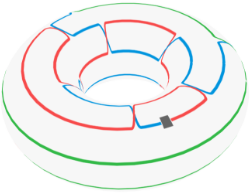

<h1>WormAlgorithmBLBQ</h1>

 

<h4>Continuous-Time Quantum Monte Carlo Simulation of the Bilinear-Biquadratic Spin-1 Chain.</h4>

 

[Visualization](#visualization) |
[Getting started](#getting-started)|
[Download thesis](https://github.com/durnwalder/WormAlgorithmBLBQ/raw/main/thesis.pdf)
 

This repository contains a Quantum Monte Carlo algorithm along with some utilities and a [thesis](https://github.com/durnwalder/WormAlgorithmBLBQ/raw/main/thesis.pdf) describing the algorithm in detail. The algorithm simulates a generalization of the AKLT model, the bilinear-biquadratic spin-1 model. The model is a striking example of the rich physics encountered in low-dimensional quantum spin systems. It exhibits symmetry protected topological order in the Haldane phase, which is fully-accesible to our algorithm. For an introduction these phenomena we refer to the [lecture by Haldane](https://www.nobelprize.org/uploads/2018/06/haldane-lecture.pdf). Our numerical study of the model relies on the worm algorithm in the path integral representation, which is formulated in continous time. The worm algorithm has been invented in the 1990s by [Prokovief et al](https://arxiv.org/abs/cond-mat/9703200). It has since become one of the most popular methods for studying bosonic lattice models and spin systems. 

# Visualisation

  

The algorithm samples worldline configurations with three species of bosonic particles (red, green and blue) and two types of interactions.  This bosonic particle model is equivalent to the AKLT model. The two black squares are what we call worm head and tail, hence the name worm algorithm. The head performs a random walk in space-time. When head and tail meet, the worm gets removed and reinserted at a random point. For a detailed discussion of the algorithms see chapter 2 in [thesis](https://github.com/durnwalder/WormAlgorithmBLBQ/raw/main/thesis.pdf).

# Getting started
WormAlgorithmBLBQ is based on the [ALPSCore](https://github.com/ALPSCore/ALPSCore)
library for physics simulations. Refer to [their website](http://alpscore.org/) for more detailed installation
instructions. ALPSCore has the following prerequisites:

  * a C++11-capable compiler.
  * CMake build system (version 3.1 or later)
  * Boost (version 1.56 or later)
  * HDF5 library 1.8.x (version 1.10 has a known problem)

## Building and installing ALPSCore
On HPC clusters, you may need to load the required modules first, e.g.  `module load gcc`.
1. Download:  
` git clone https://github.com/ALPSCore/ALPSCore.git` or <a href="https://github.com/ALPSCore/ALPSCore.git">download .zip file</a> 

2. Build:  
`cd ALPSCore`  
`mkdir build`  
`cd build`  
`cmake .. -DALPS_INSTALL_EIGEN=yes -DCMAKE_INSTALL_PREFIX=/where/to/install/ALPSCore`  
`make ` 
`make test` 

3. Install:  
`make install`    
## Building and running WormAlgorithmBLBQ

1. Download:  
`git clone https://github.com/durnwalder/WormAlgorithmBLBQ` or <a href="https://github.com/durnwalder/WormAlgorithmBLBQ/archive/master.zip">download .zip file</a> 

1. Build:  
`cd WormAlgorithmBLBQ`  
`cd src`  
`mkdir build`  
`cmake ..`  
`make` 

1. Run:  
`./qmc_worm ../parameter_files/aklt.ini`    

The parameter file `aklt.ini` contains the parameters for the AKLT model, which was also used for the [Visualisation](#visualisation).
