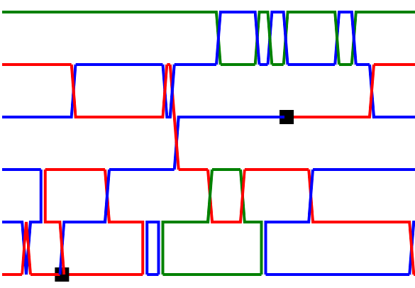
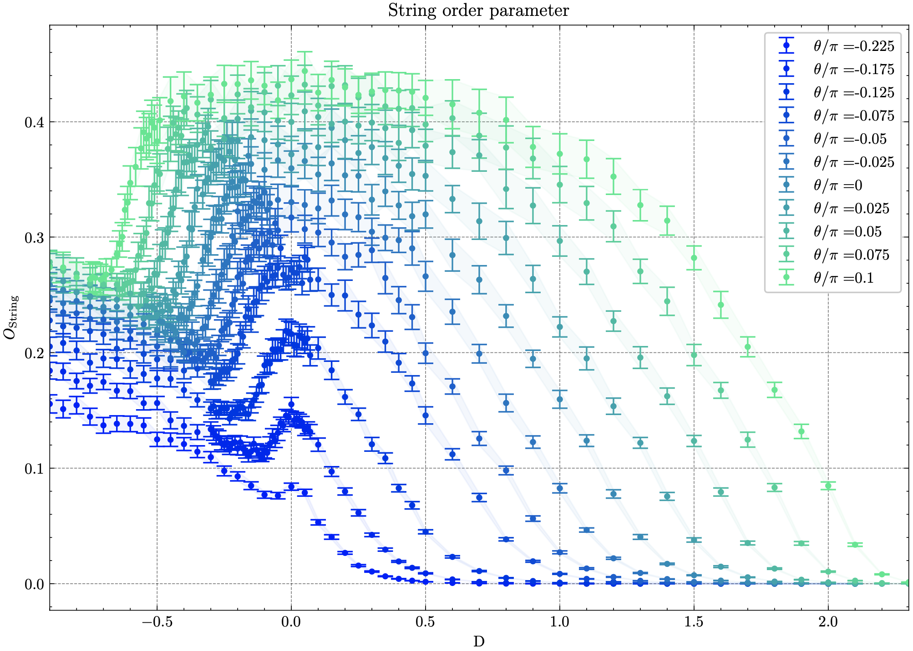

# Continuous-time quantum Monte Carlo simulation of the bilinear-biquadratic Spin-1 chain

  

| [**Prerequisites**](#prerequisites)
| [**Install guide**](#installation)
| [**Running the simulation**](#running-the-simulation)
| [**Parameter files**](#parameter-files)
| [**Model selection**](#transformations)
| [**Order Parameters**](#order-parameter)
| [**Output files**](#output-files)
| [**Quick start**](#quick-start)

The bilinear-biquadratic spin-1 chain is a striking example of the rich physics encountered in low-dimensional quantum spin systems. The various phases of the model were extensively studied with different analytical and numerical techniques. Most of the early numerical work on this model was done using exact diagonalization and, more recently, DMRG.  Our numerical study of the model relies on Quantum Monte Carlo, more specifically, the worm Algorithm in the path Integral representation. The worm algorithm was invented in the 1990s by Prokovief et al \cite{prokofev_exact_1998}. It is one of the most popular methods to study bosonic lattice models and spin systems. 

$$H=\sum_{i=1}^{N-1} \cos (\theta)  \vec{S}_{i} \otimes \vec{S}_{i+1}+\sin (\theta) \left(\vec{S}_{i} \otimes \vec{S}_{i+1}\right)^{2}+\sum_{i=1}^{N} D\left(S_{i}^{z}\right)^{2}$$

    

Requirements
------------

These codes are based on the [ALPSCore](https://github.com/ALPSCore/ALPSCore)
library. Refer to [their website](http://alpscore.org/) for installation
instructions. At the time of this writing, ALPSCore imposed the following system
requirements:

  * C++ compiler
  * CMake build system (version 3.1 or later)
  * Boost (version 1.56 or later)
  * HDF5 library 1.8.x (version 1.10 has a known problem)
  
Beyond these, our codes require

  * a C++11-capable compiler. We have only tested our code when ALPSCore is installed with modern compilers that have C++11 features turned on by default.

  

## Prerequisites
-------------------------

### Building and installing ALPSCore

Detailed instructions on
[how to build ALPSCore](https://github.com/ALPSCore/ALPSCore/wiki/Installation)
can be fournd in the project's wiki. The procedure revolves around the following:

    $ cd alpscore
    $ mkdir build.tmp && cd build.tmp
    $ cmake ..
    $ make -jN
    $ make test

## Quick Start
### Running the simulation
1. Clone repository (git users), or [download] and unzip.
2. Open terminal, `cd` into root directory 
3. Run `make ` [^1]
5. Open
[^1]: Requires Alpscore. Install with 
## Parameter files

## Output files
Output files

## Model Selection
## Order Parameters

  

  

