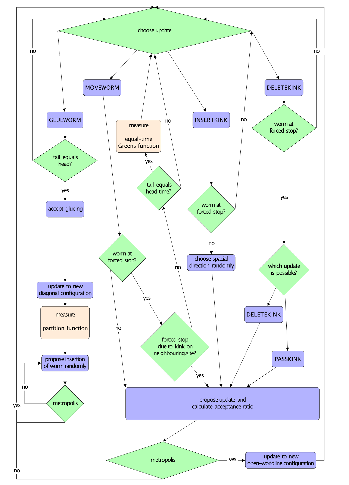

# Continuous-time quantum Monte Carlo simulation of the bilinear-biquadratic Spin-1 chain

  

| [**Prerequisites**](#prerequisites)
| [**Install guide**](#installation)
| [**Running the simulation**](#running-the-simulation)
| [**Parameter files**](#parameter-files)
| [**Model selection**](#transformations)
| [**Order Parameters**](#order-parameter)
| [**Output files**](#output-files)
| [**Quick start**](#quick-start)

# Getting started
These codes are based on the [ALPSCore](https://github.com/ALPSCore/ALPSCore)
library. Refer to [their website](http://alpscore.org/) for installation
instructions. At the time of this writing, ALPSCore imposed the following system
requirements:

  * C++ compiler
  * CMake build system (version 3.1 or later)
  * Boost (version 1.56 or later)
  * HDF5 library 1.8.x (version 1.10 has a known problem)
  
Beyond these, our codes require

  * a C++11-capable compiler. We have only tested our code when ALPSCore is installed with modern compilers that have C++11 features turned on by default.

## Building and installing ALPSCore
On HPC clusters, you may need to load the required modules first, e.g.  `module load gcc`.
1. Download:  
` git clone https://github.com/ALPSCore/ALPSCore.git` or <a href=" git clone https://github.com/ALPSCore/ALPSCore.git">download .zip file</a> 

2. Build:  
`cd ALPSCore`  
`mkdir build`  
`cd build`  
`cmake .. -DALPS_INSTALL_EIGEN=yes -DCMAKE_INSTALL_PREFIX=/where/to/install/ALPSCore`  
`make ` 
`make test` 

3. Install:  
`make install`    
## Building and running WormAlgorithmBLBQ

1. Download:  
`git clone https://github.com/durnwalder/` or <a href="https://github.com/khavernathy/mcmd/archive/master.zip">download .zip file</a> 

2. Compile:  
`cd mcmd`  
`cd src`  
`bash compile.sh   [ options ]`  
`cd ..`  
`export PATH=$PATH:/path/to/mcmd/` 

3. Run:  
`mcmd mcmd.inp`    

The bilinear-biquadratic spin-1 chain is a striking example of the rich physics encountered in low-dimensional quantum spin systems. The various phases of the model were extensively studied with different analytical and numerical techniques. Most of the early numerical work on this model was done using exact diagonalization and, more recently, DMRG.  Our numerical study of the model relies on Quantum Monte Carlo, more specifically, the worm Algorithm in the path Integral representation. The worm algorithm was invented in the 1990s by Prokovief et al \cite{prokofev_exact_1998}. It is one of the most popular methods to study bosonic lattice models and spin systems. 

$$H=\sum_{i=1}^{N-1} \cos (\theta)  \vec{S}_{i} \otimes \vec{S}_{i+1}+\sin (\theta) \left(\vec{S}_{i} \otimes \vec{S}_{i+1}\right)^{2}+\sum_{i=1}^{N} D\left(S_{i}^{z}\right)^{2}$$

    

Requirements
------------

  

-------------------------
## Parameter files

## Output files
Output files

## Model Selection
## Order Parameters

  

  

